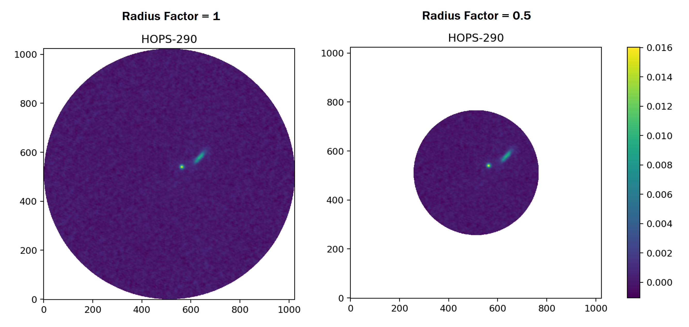
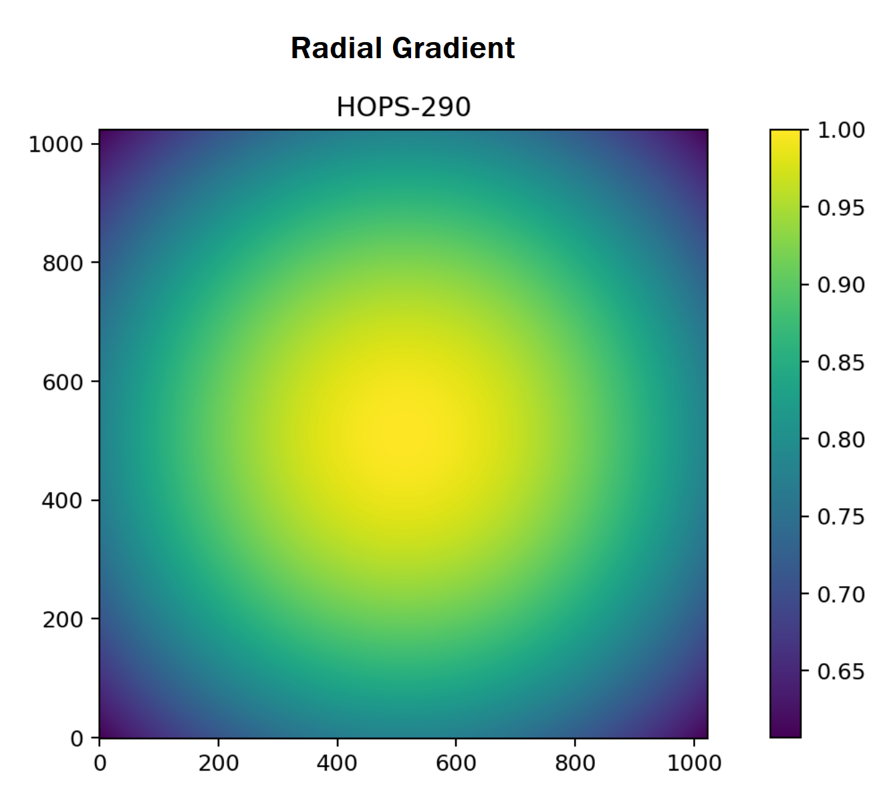
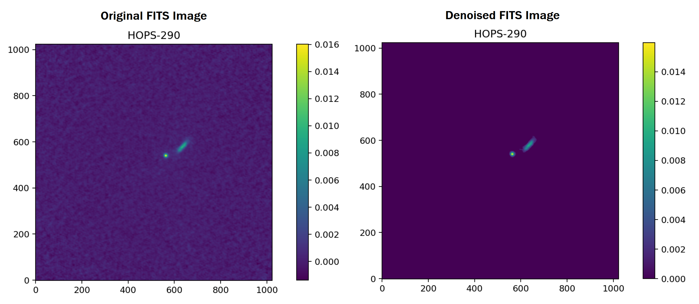

## Overview

The first step in the group-detection pipeline is to reduce the background noise in the raw FITS image data. In the Clustar package, all of the methods involved in the denoising step are listed in the `denoise.py` module. 

## Circle Crop

Given that most of the noise in a FITS file is concentrated around the corners of the image, we begin the preprocessing by transforming the square FITS image into a circle. In particular, the `crop` method is implemented to remove the intensities in the corners. Here, the user can define two optional parameters: `radius_factor` and `apply_gradient`. 

The `radius_factor` is number within the range $[0, 1]$ that is multiplied to the radius of the cropping circle; this determines the size of the circle. Shown below are three examples of how the `radius_factor` affects the cropping circle.

    

The `apply_gradient` parameter determines if the FITS image should be multiplied by a gradient in order to elevate central points. With this multiplication, the erratic intensities that are located further away from the center are more likely to be accounted as noise. Shown below is the radial gradient that is multiplied to the FITS data.

    

## Grid Computation

The straightforward method for noise reduction is to determine a target threshold and automatically set all intensities below that threshold to zero. In [sigma clipping](https://www.gnu.org/software/gnuastro/manual/html_node/Sigma-clipping.html), the noise is assumed to follow a Gaussian distribution; from this, the standard deviation $(\sigma)$ and the median $(m)$ of the dataset are calculated. Given a coefficient, $\alpha$, any value that lies outside of the range $m \pm \alpha \sigma$ is considered to be noise. 

Inspired by sigma clipping, our denoising algorithm divides the FITS image to $n \times n$ grid (package keyword `chunks` parameter specifies $n$). For each cell in this grid, the root mean square (RMS) of the intensities are calculated. Given a `quantile` probability between $[0, 1]$, the specified quantile of all the RMS in the grid denotes the baseline noise threshold. The target threshold is obtained by multiplying this baseline threshold to a given `sigma` coefficient. All intensities below this target threshold are set to zero.

> [!NOTE]
> Since the `chunks` parameter determines the size of the grid, the computational complexity of the denoising process is tied to this parameter. On the backend, the package implements multithreading to expedite this process; the RMS value for each cell is run on a separate thread. For comparable results, it is recommened that the value of the `chunks` parameter is $3$, $5$, or $7$.

## Denoise

In the `denoise.py` module, the `resolve` method performs the entire denoising process, according to the specified `ClustarData` parameters. Shown below is the example FITS image before and after the denoising process; here, the background noise is removed.

    

