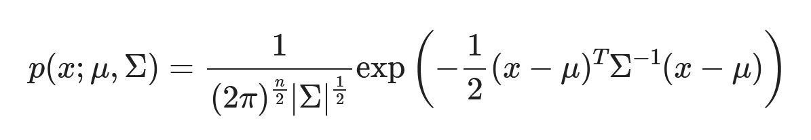
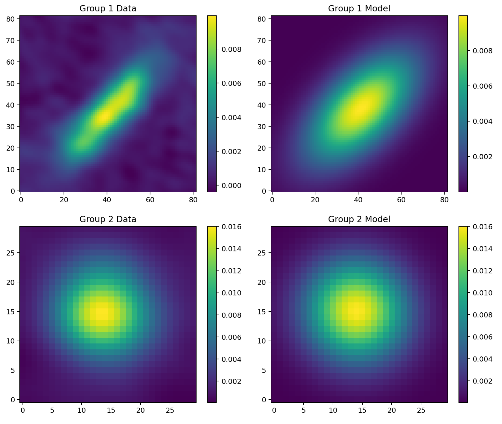
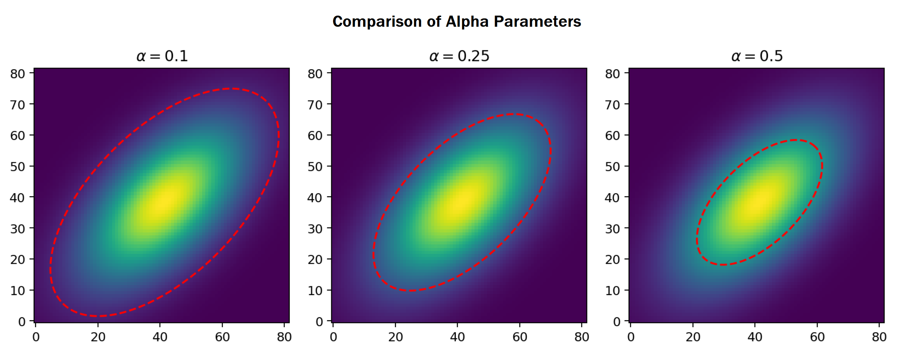
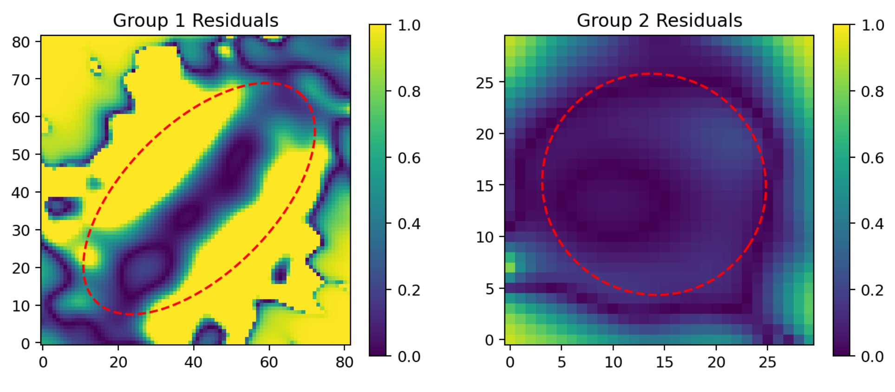
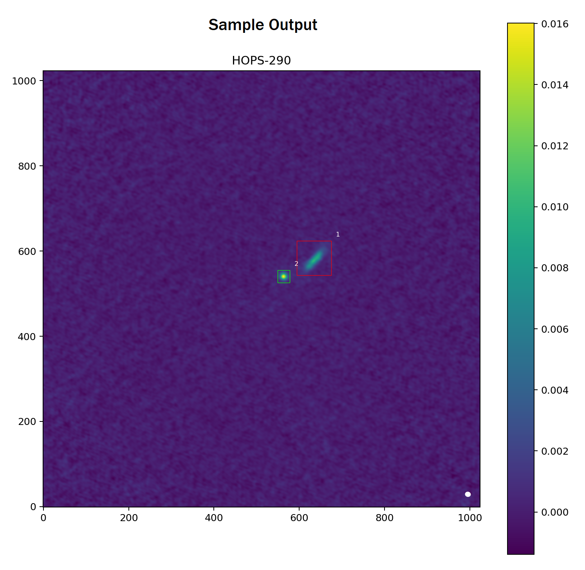

## Overview

The last step in the group-detection pipeline is fitting a bivariate Gaussian model on each of the detected groups in order to find anomalous groups (i.e. do not conform to the bivariate Gaussian shape). In this package, all of the fitting-related methods are listed in the module `fit.py`.

## Fit Bivariate Gaussian

Generally, many protostellar objects have a disk-like shape that conforms to a bivariate Gaussian distribution. The input parameters for this model are the two-dimensional weighted means and the associated covariance matrix.

    

In the Clustar package, the `compute_fit` method calculates the respective bivariate Gaussian model for each detected group in the FITS image. Then, a min-max normalization is performed on the bivariate Gaussian model with respect to the original data. The residuals are obtained by taking the difference of the intensities between the model and the observed data. Shown below are the normalized bivariate Gaussian models (depicted on the right) associated with each detection (depicted on the left), given the previous FITS image.

    

## Ellipse Construction

Although the min-max normalization aligns the model to the original data, this process causes the tail ends of the bivariate Gaussian model be an unreliable estimate. To exclude these tail ends, the `compute_ellipse` method constructs an ellipse from the respective group statistics. The `alpha` parameter designates the size of this ellipse in relation to the $\chi^2$ distribution. Shown below is a depiction of how the `alpha` parameter affects the size of the ellipse.

    

## Residual Analysis

Before the residuals are converted into a numerical score, the absolute value of the residuals inside of the ellipse are taken and these values are binned between $[0, 1]$ in the `compute_metrics` method. Shown below are the processed residuals for the previously depicted groups.

    

Given a `metric` (e.g. average, standard deviation, variance) and a `threshold`, these processed residuals can help determine which detections conform to the model bivariate Gaussian as well as those that do not. For this package, the default is set the variance metric at a threshold of $0.01$. From the sample FITS image, the variances of these residuals are $0.1483$ and $0.0028$ for groups 1 and 2, respectively. Since the first group's score exceeds the default threshold, this group is flagged for manual review (depicted in red). In contrast, the second group's score is below the default threshold; as a result, this group conforms to the model bivariate Gaussian shape (depicted in green).

    

