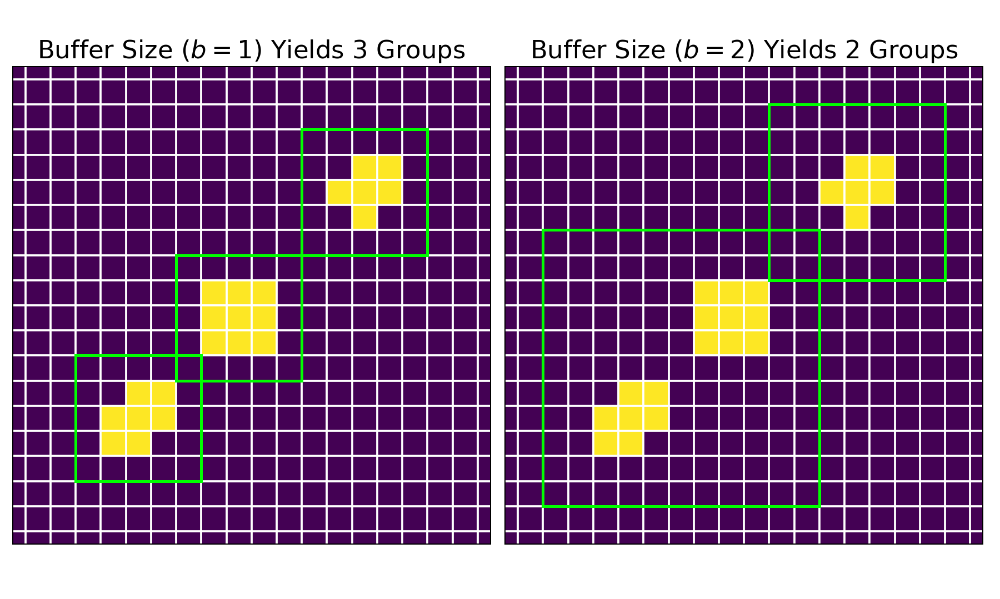

## Overview

After denoising the image, the next step is to arrange the remaining nonzero intensities into groups, while accounting for any outliers. In the module `group.py`, all of the methods related to this step are listed. 

## Arrange Points

In this package, the `arrange` method organizes the nonzero intensities into groups based on their proximity. A group is defined as set of neighboring intensities, and a group-range delimits the bounds of a group. Given an integer `buffer_size`, all nonzero points that lie within this group-range are accounted as one group; particularly, the `buffer_size` is the number of pixels around the group that are examined for nonzero intensities. Shown below is a figure of how the `buffer_size` parameter affects the grouping.

    

For both images, pixels containing zero intensities are depicted in purple, while those containing nonzero intensities are shown in yellow. The group arrangements are represented by the green squares. On the left, a `buffer_size` of $1$ yields three groups; on the right, a `buffer_size` of $2$ yields two groups.

From these preliminary group-ranges, the `rectify` method ensures that these group-ranges are squares (i.e. height and width of groups are equivalent). Next, the `merge` method eliminates all smaller group-ranges that lie completely inside a larger group-range; this step makes sure that the labeled groups are independent.

## Outlier Filtration

Even after denoising, the resulting data could still contain nonzero intensities that represent noise. The `refine` method accounts for these outliers by employing the `group_size` and/or `group_factor` specifications. The `group_size` parameter defines the minimum number of nonzero points that determines a group. Similarly, the `group_factor` ratio (lies within $[0, 1]$) specifies the minimum number of nonzero points that determines a group in relation to the number of nonzero points in the largest group. After this step, the `extract` method pulls the original FITS data for each group, given the group-range.

Lastly, the `screen` method removes groups that are faint and distant from the center of the FITS image. To accomplish this, the `screen` method calculates the maximum intensity in the remaining groups relative to the entire FITS image as well as the Euclidean distance of the groups' center to the image center. Given that both of these metrics are strictly less than $1$, the arithmetic mean of these measures yields an "outlier score." If this score is less than the default threshold of $0.25$, then that group is considered to be an outlier and is subsequently removed. Shown below are the two detected groups from the previously denoised FITS image.

    

## Group Statistics

From the remaining groups, the `calculate` method computes the following statistics on the group data.

| Statistic | Definition |
|:----------|:-----------|
| `x_bar`   | Average of index values in the 'x' position weighted by the corresponding group data. |
| `y_bar`   | Average of index values in the 'y' position weighted by the corresponding group data. |
| `x_var`   | Variance of index values in the 'x' position weighted by the corresponding group data. |
| `y_var`   | Variance of index values in the 'y' position weighted by the corresponding group data. |
| `covariance` | Covariance of the index values weighted by the corresponding group data. |
| `covariance_matrix` | Covariance matrix for the multivariate normal that is used in the fitting process. |
| `rho` | Correlation coefficient computed from the covariance matrix. |
| `eigen_values` | Eigenvalues obtained from the eigendecomposition of the covariance matrix. |
| `eigen_vectors` | Eigenvectors obtained from the eigendecomposition of the covariance matrix. |
| `x_len` | Length of the major axis of the ellipse in pixels. |
| `y_len` | Length of the minor axis of the ellipse in pixels. |
| `radians` | Rotation of ellipse denoted in radians. |
| `degrees` | Rotation of ellipse denoted in degrees. |
