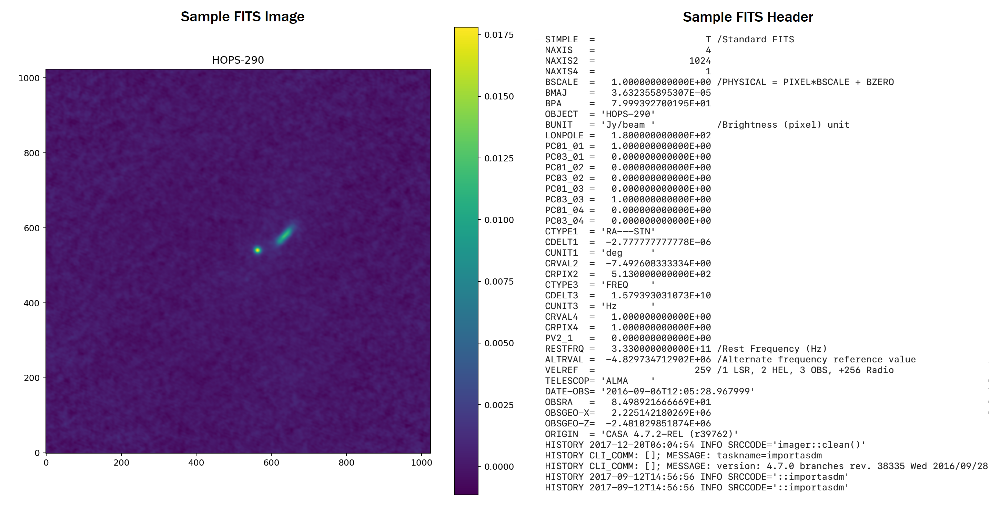

## Motivation

The National Radio Astronomy Observatory’s ALMA science [archive](https://almascience.nrao.edu/aq/) contains over a petabyte of astronomical images which has been collected by the Atacama Large Millimeter/sub-millimeter Array (ALMA) telescope over the last decade. While the archive data is publicly available, the task for astronomers to manually search through thousands of images and ascertain the type and physical properties of unusual celestial objects is immensely labor intensive. As a result, an exhaustive manual search of the archive is unlikely to be comprehensive and creates the potential for astronomers to miss out on faint objects that were not the primary target of the telescope exposure. For these reasons, the goal of our Clustar package is to programmatically identify protostars/protoplanetary disks from astronomical data contained in these images.

## Data

The astronomical data stored in the ALMA archive is contained in [Flexible Image Transport System](https://en.wikipedia.org/wiki/FITS) (FITS) format. FITS files store this data in multi-dimensional arrays (one-dimensional spectra, two-dimensional images, or three-dimensional data cubes). In addition to this data, FITS files generally include a `header` object that contains statistics, logs, and other details relevant to the image. 

Shown below is the image and header information from a FITS file in the [Tobin et al.](https://ui.adsabs.harvard.edu/abs/2020ApJ...890..130T/abstract) dataset. The contents within this FITS file are accessed by implementing the `fits` method from the [astropy](https://www.astropy.org/) package; subsequently, the FITS image is visualized by using the `imshow` method from the [matplotlib](https://matplotlib.org/) package.

```
from astropy.io import fits
import matplotlib.pyplot as plt

# Path to FITS file.
path = '~/HOPS-290_cont_robust0.5.pbcor.fits'

# Open FITS file.
file = fits.open(path)

# Image data from the FITS file.
image = file[0].data[0, 0, :, :]

# Header information from the FITS file.
header = file[0].header

# Visualize FITS image.
plt.figure(figsize=(10, 10), dpi=180)
plt.imshow(image, origin='lower')
plt.title(header['OBJECT'])
plt.colorbar()
plt.show()
```

<center>
    
</center>

## Pipeline

In the Clustar package, the detection of protostars or protoplanetary disks is built on top of the following pipeline. First, the raw FITS image undergoes a preprocessing step to reduce the background noise. From this denoised image, the nonzero intensities (i.e. the data from the FITS image) are arranged into groups based on their proximity. Next, these formulated groups undergo a filtration process to remove any outliers. Given the remaining groups, a model bivariate gaussian is generated from the respective group statistics (e.g. mean, variance). Then, the residuals are calculated by subtracting the model from the original group data. Finally, these residuals are compared to a user-defined metric and threshold in order to demarcate which groups are flagged for manual review. In summary, this entire pipeline can be condensed into three main steps: denoising, grouping, and fitting. 

Given a FITS image, the `ClustarData` object executes this pipeline for detecting groups and stores all relevant data associated with each group. Shown below is the sample output for the FITS file described above. The detection shown in the green box conforms to a model bivariate gaussian, whereas the detection shown in the red box is flagged for manual review since variance of the residuals exceeds the user-defined threshold.

```
from clustar.core import ClustarData

# Create the 'ClustarData' object by specifying the path to FITS file.
cd = ClustarData(path='~/HOPS-290_cont_robust0.5.pbcor.fits')

# Visualize the detected groups.
cd.identify()
```

<center>
    
</center>
